# Series Temporales en R

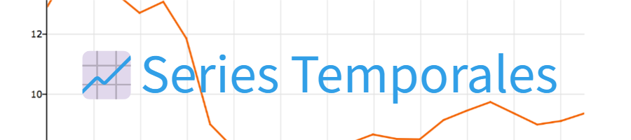

## Introducción

Esta tarea personal sirve para la puesta en práctica del estudio de series temporales. 
He descargado un conjunto de datos de la página web de [Kaggle](https://www.kaggle.com/datasets/sudalairajkumar/daily-temperature-of-major-cities) que contiene los valores de temperatura media diaria de las principales ciudades del mundo. Dichas temperaturas son recogidas en Fahrenheit desde el 1 de enero de 1995 hasta el 13 de mayo de 2020. 

Las características más importantes a tener en cuenta para nuestro estudio son las siguientes:

- **Region**: Nombre de la región.
- **Country**: País.
- **State**: Nombre del estado (en caso de tenerlo).
- **City**: Nombre de la ciudad
- **Month**: Número del mes. 
- **Day**: Número del día.
- **Year**: Año al que pertenece la medida.
- **AvgTemperature**: Temperatura promedio de la entrada en fahrenheit.

El objetivo de este estudio es intentar predecir la tendencia de temperatura en los próximos años. Como el tamaño de los datos es excesivamente grande, voy a filtrar y focalizar el estudio en una ciudad en concreto. 

Para esta tarea, recogeremos el primer valor de temperatura de cada mes de la ciudad de Madrid desde el año 2000 hasta el 2014 incluido. En estos 14 años de datos encontramos un total de 168 observaciones para estudiar. Para la predicción hay margen hasta el 2020, pero con intentar predecir las siguientes 12 observaciones tenemos suficientes (lo que equivale predecir al año 2015 en su totalidad).

## Representación gráfica, descomposición y análisis de los datos

Al seleccionar el primer valor de cada mes, se nos queda una un conjunto de periodo 12. Si visualizamos nuestros datos observamos que tienen una media constante y una varianza
acotada. 

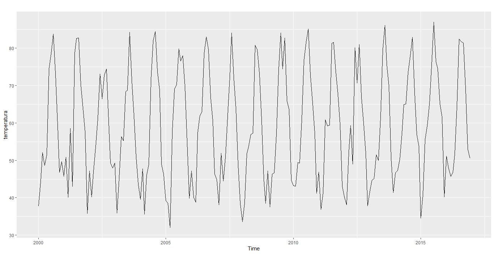

Con el gráfico anterior, somos capaces de confirmar que los datos se ajustan a un esquema aditivo. Con la descomposición estacional concluimos que febrero es el mes más frío (-17.20) y agosto el más caluroso (+22.96).

Para el análisis de las serioes temporales aditivas, es necesaria desglosar su información en tres componentes principales: tendencia, estacionalidad y residuo. Esto nos facilita el análisis individual de cada componente y así comprender mejor el comportamiento de los datos a través del análisis de patrones o ifentificación de anomalías.

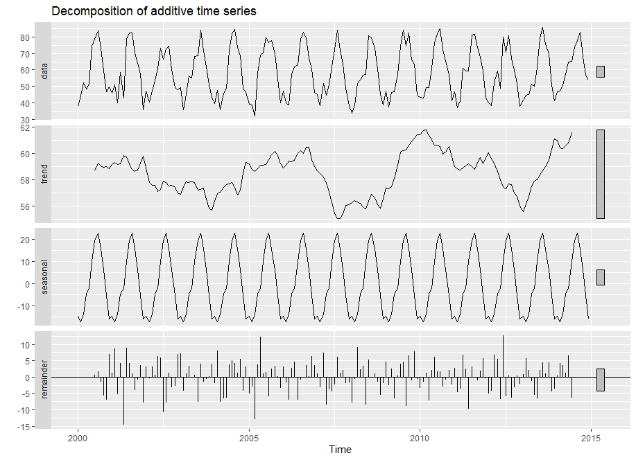

En la imagen anterior se encuentran representadas las principales caracterísiticas que construyen una serie temporal:

- **Data**: Representa la serie temporal completa. Es la suma de los tres componentes de tendencia, estacionalidad y residuo. Podemos ver oscilaciones regulares (que indican estacionalidad), y ligeros cambios (indican tendencia).
- **Trend**: Refleja la tendencia de los cambios durante el periodo. En este caso podemos apreciar un aumento gradual entre el año 2000 y 2005, seguido de una caída y una recuperación hasta 2015.
- **Seasonal**: La componente estacional son variaciones periódicas cíclicas que se repiten de manera regular. Nuestra periocidad es anual y casi idéntica por cada ciclo.
- **Remainder**: Con el residuo reflejamos aquello que no puede explicarse ni por la tendencia o la estiacionalidad. En nuestro caso, no podemoso observar un patrón claro, lo que sugiere variabilidad residual.

Agrupar la información de cada mes a lo largo del año también puede ayudar a entender nuestro caso de uso. 

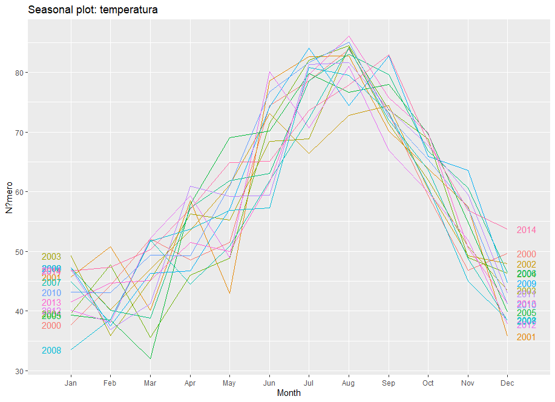

Observando el par de imágenes anteriores concluimos que la serie tiene un comportamiento estacional que se repite cada año, donde agosto despunta en contener los valores más altos. Además, observamos una minúscula tendencia que aumenta con los años. 

## Modelados de suavizado exponencial

Los modelos de suavizado exponencial nos sirven para predecir valores futuros basándose en un promedio ponderado de valores pasdados. Estos modelos son ampliamente usados debido a su simplicidad, flexibilidad y capacidad para adaptarse a datos con componentes de tendencia y estacionalidad. Tres de los modelos más utilizados son:

### Método simple

Usados para series que no representan tendencia ni estacionalidad. Usamos la funcion *ses()* y predecimos los siguientes 12 meses.

```
temperatura_ses=ses(temperatura_TR, h=12)
summary(temperatura_ses)

autoplot(temperatura_ses) + autolayer(fitted(temperatura_ses), series="Fitted") + ylab("Temperatura") + xlab("Año")
```

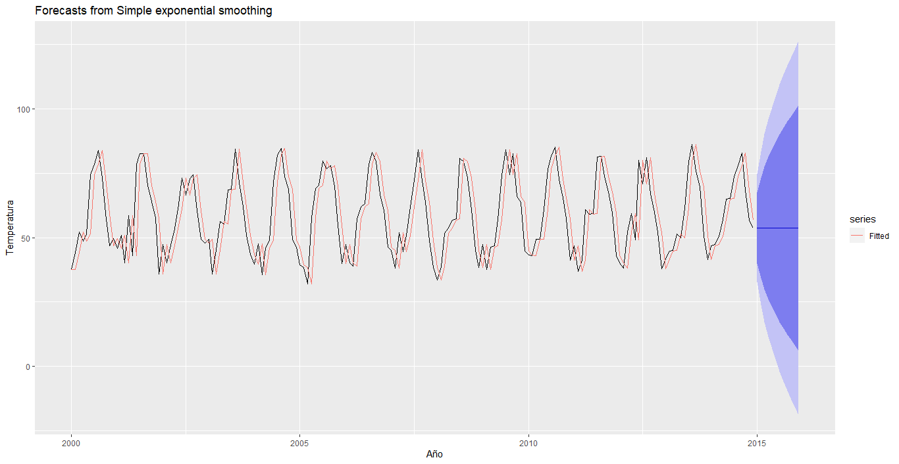

### Método Alisado Doble de Holt

Usados para series con tendencia y sin estacionalidad. Utilizaremos la funcion *holt()* y predecimos los siguientes 12 meses.

```
temperatura_sh <- holt(temperatura_TR, h=12)    
summary(temperatura_sh)

autoplot(temperatura_sh) + autolayer(fitted(temperatura_sh), series="Fitted") + ylab("Temperatura") + xlab("Año")
```

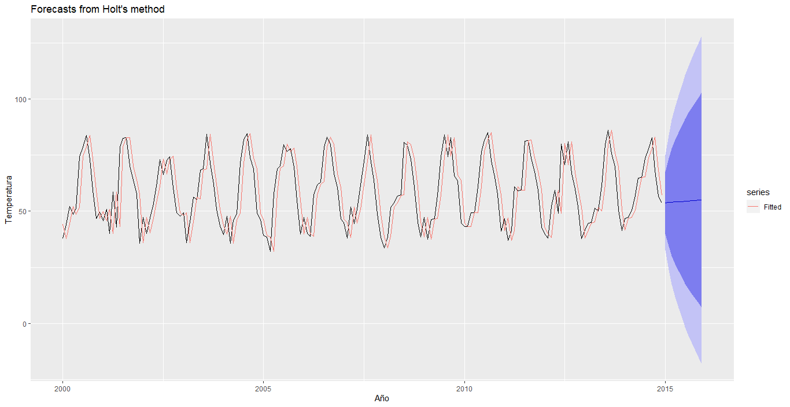

### Método alisado Holt-Winters

Este método incluye las mejoras para trabajar con series estacionales y con tendencia. La funcion *hw()* nos permite introducir que su naturaleza sea aditiva. Predecimos los siguientes 12 meses.

```
fit1 <- hw(temperatura_TR, h=12, seasonal="additive")
summary(fit1)

autoplot(fit1) + autolayer(fitted(fit1), series="Fitted") + ylab("temperatura)") + xlab("Año")
```

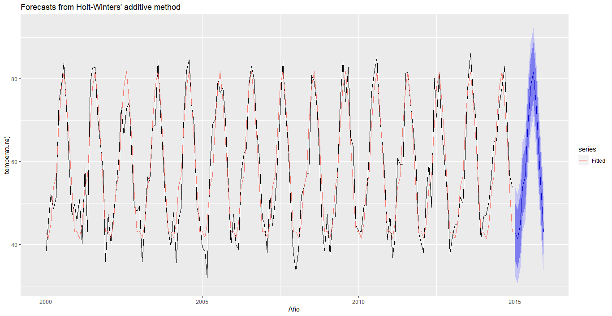

Concluimos que el método que mejor ajusta y predice nuestra serie es el método de alisado de Holt-Winters. Gracias a la función  *summary()* del modelo ganador obtenemos los siguientes valores de Alpha, Beta y Gamma con el que construir la expresión del método ganador.

𝐿𝑡 = 1e-04 (𝑥𝑡/𝑆𝑡−𝑠) + (1 − 1e-04) (𝐿𝑡−1 + 𝑏𝑡−1)

b_t=〖1e-04 (L〗_t-L_(t-1 ))+ 1e-04 b_(t-1)

𝑆t = 1e-04 (𝑥𝑡/𝐿𝑡 ) + ( 1 − 1e-04) 𝑆t-s 

x ̂𝑡+1 = (𝐿𝑡 + 𝑏𝑡 ) 𝑆𝑡−𝑠+1

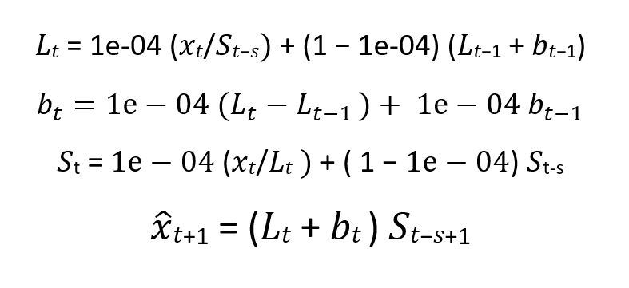

## Funciones de autocorrelación simple y espacial

Es el momento de extraer los valores de autocorrelación simple (ACF) y espacial (PACF). Estas cantidades miden la relación lineal entre las variables de la serie separadas por *k* posiciones. Para la variante espacial, las posiciones están separadas por el tiempo. Ambas funciones nos ayudan a determinar los parámetros de los modelos que vamos a estudiar.

```
ggAcf(temperatura_TR, lag=48)
```

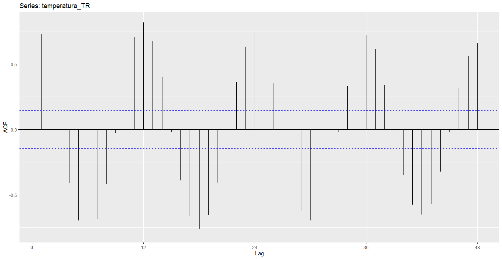

```
ggPacf(temperatura_TR,lag=48) 
```


Recordamos que la variable temperatura_TR es la ventana de datos extraídos para la parte de predicción, desde el año 2000 hasta el 2014.

Se observa un comportamiento repetitivo de las autocorrelaciones cada 12 meses en la ACF, observando como la autocorrelación más fuerte es en los retardos múltiplos de 12. Como la serie presenta estacionalidad, por lo que tomamos una docena de diferenciación.

```
ggAcf(diff(temperatura_TR), lag=48)
```


```
ggPacf(diff(temperatura_TR), lag=48)
```
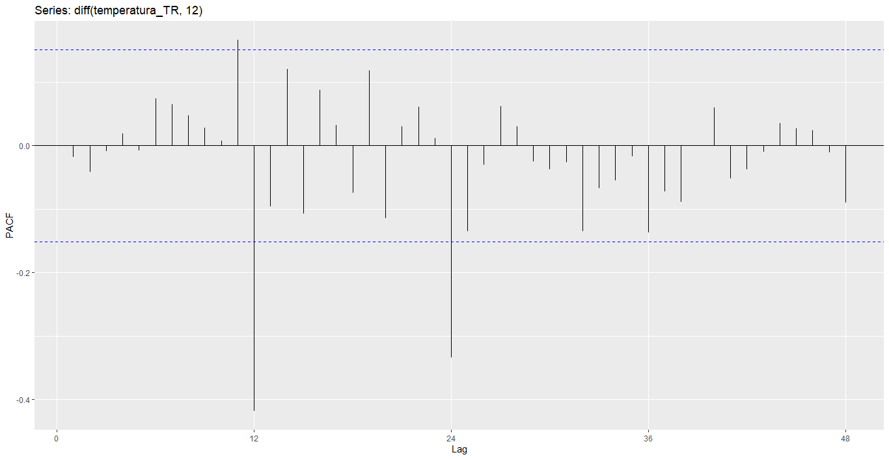


Procedamos a ajustar el modelo adecuado. Para ello, elaboraremos diferentes modelos con el fin de compararlos y elegir un ganador a través de la función *arima()*. 
En el determinamos los parámetros del modelo siguiendo unos comportamientos en las gráficas de ACF y PACF. En este caso, como nuestra serie tiene una estacionalidad 12, solo hay que observar los retardos múltiplos de 12. 

```
t_fitARIMA_1<-arima(temperatura_TR,order=c(0,1,0), seasonal=c(0,1,1))
t_fitARIMA_2<-arima(temperatura_TR,order=c(1,1,1), seasonal=c(0,1,1))
t_fitARIMA_3<-arima(temperatura_TR,order=c(0,1,0), seasonal=c(0,1,3))
t_fitARIMA_4<-arima(temperatura_TR,order=c(0,0,1), seasonal=c(1,1,0))
```

Con la función *summary()* seremos capaces de recuperar los coeficientes sigma estimado y medidas de error de entrenamiento para poder compararlos todos. Sin embargo, la función *coeftest()* nos comprueba la idoneidad del modelo automáticamente. 

### Modelo 1

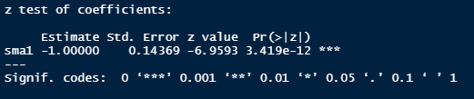
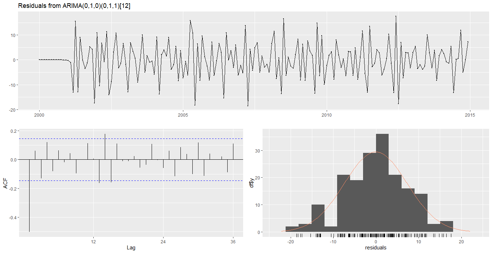

### Modelo 2

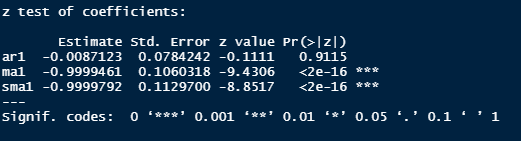
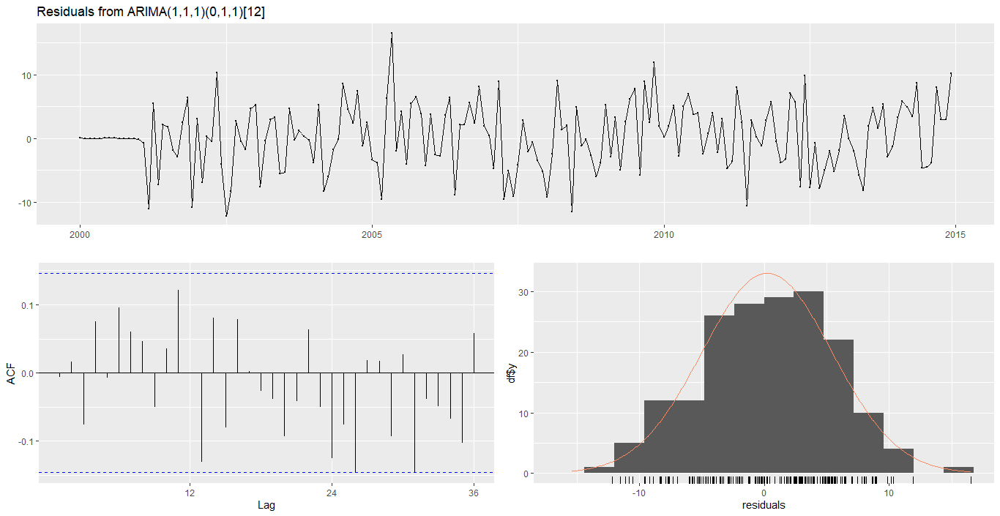

### Modelo 3

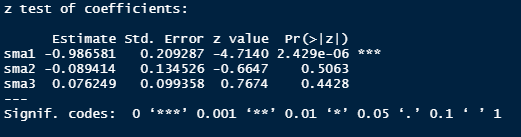
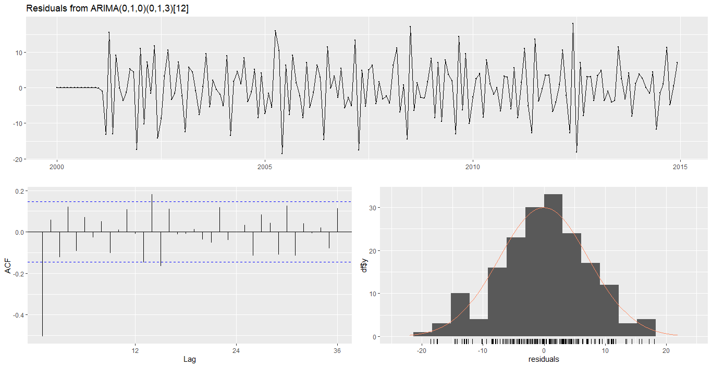

### Modelo 4

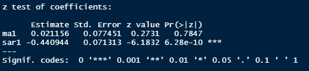
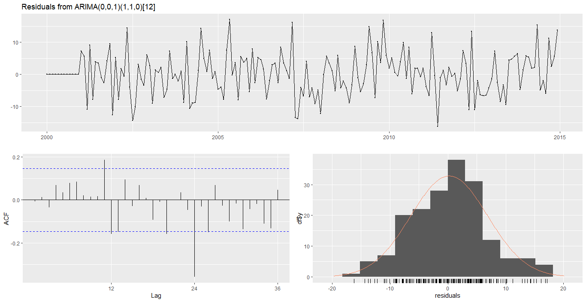

### Resultados

Antes de determinar un ganador deberemos comprobar los residuos en el que, si el modelo se aproxima satisfactoriamente a la serie observada, los residuos deben tender a comportarse como ruido blanco. Es por eso por lo que el residuo que más uniforme parezca es el mejor. Viendo las siguientes ilustraciones podemos quedarnos entre dos modelos, el segundo y cuarto. 

Después de un análisis, selecciono como ganador el modelo 4. El factor diferenciador para seleccionar como ganador un modelo, es que tiene menos coeficientes (coeftest).

La expresión algebraica del modelo ganador es la siguiente:

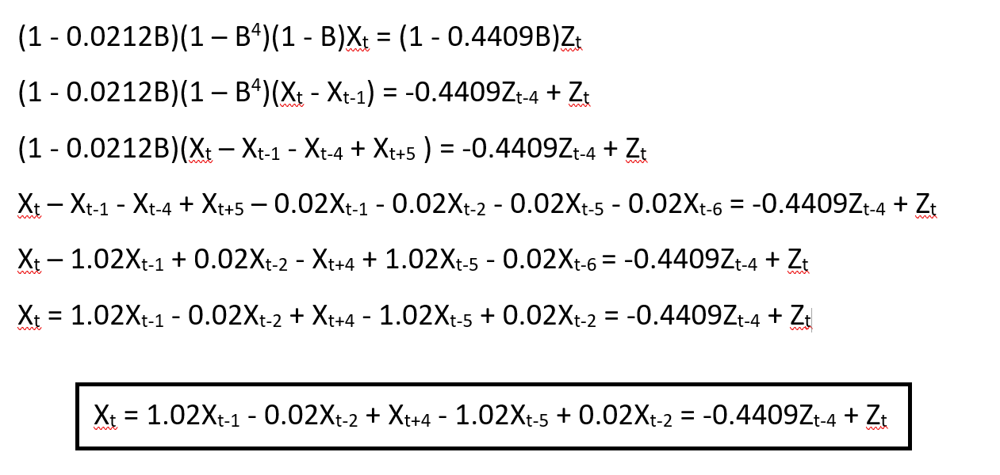

## Predicciones e intervalos de confianza

Es el momento de calcular la predicción y los intervalos de confianza para el modelo ganador (modelo 4). La función *forecast()* recibe el modelo deseado y el numero de unidades a predecir. En este caso, veo razonable intentar predecir **24 meses**. 

```
# Calculo de las predicciones y los intervalos de confianza para el modelo mas adecuado (t_fitARIMA_4)
forecast(t_fitARIMA_4,h=24)
summary(forecast(t_fitARIMA_4,h=24))

# Representar las predicciones obtenidas
autoplot(forecast(t_fitARIMA_4),h=24)
```

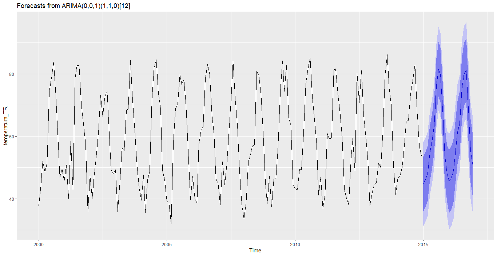


Como mencioné al principio, nuestros datos iban dese el año 1995 hasta el 2020, pero trabajamos del 2000 al 2015, tenemos la suerte de poder comparar la predicción con los datos reales (las imágenes están alineadas). 


Observando las tres imágenes, se ve a primera vista que la estimación realizada con el modelo Holt-Winters parece la más ajustada. En los datos reales, se da que el año 2016 se generan picos de temperatura. Comparando y usando como referencia el año 2013, el 2016 sobre pasa muy levemente el pico de temperatura. Los intervalos de confianza en el modelo ARIMA son más “grandes”, lo que indica mayor margen de error, por el otro lado en el modelo Holt-Winters, el borde del intervalo de confianza del 95% coincide con los datos reales. Es por eso por lo que concluyo que el modelo Holt-Winters está mejor ajustado, sin embargo, el de ARIMA predice mejor ya que tiene en cuenta (y por eso dejo el margen) una mayor variación.

